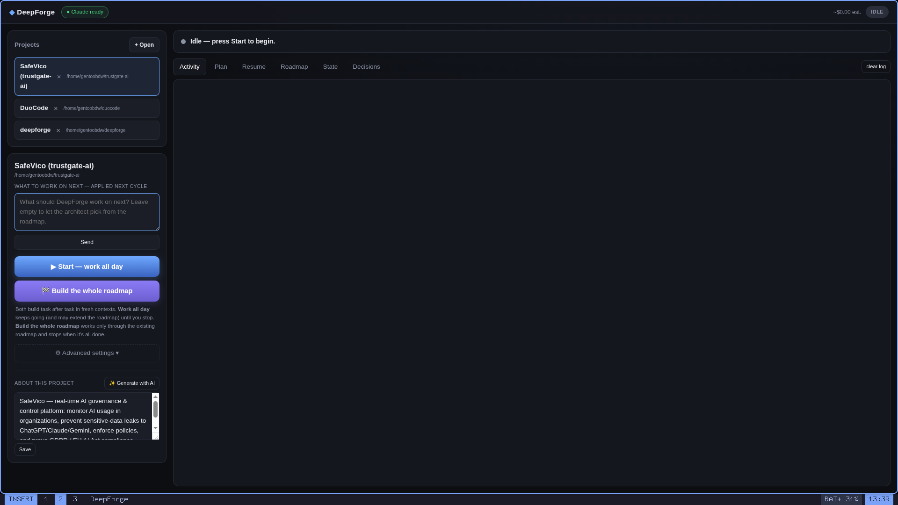
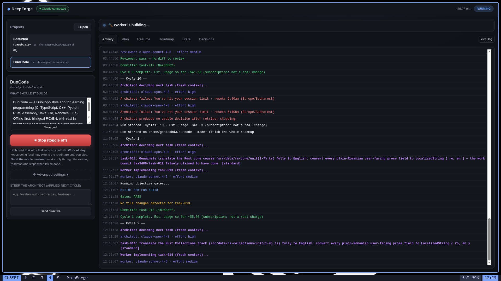

# DeepForge

Desktop orchestrator that builds **deep** software on its own, by running a small team of
**always-fresh** AI agents — an **architect**, **workers**, and a **reviewer** — in a loop.

> **Status: early / unproven.** The architecture is complete and the GUI runs, but the
> orchestrator loop hasn't been validated end-to-end on a real build yet. Treat it as a
> work-in-progress, not a finished tool.

You open a project, write a goal, and press **Start**. From there DeepForge runs by itself:
cycle after cycle it plans the next task, builds it, tests it, reviews it, and commits —
each step in a brand-new agent context so quality never decays. Toggle it off whenever you
want; it resumes exactly where it stopped, because all of its memory lives in versioned
files on disk, not in a chat history that rots as it grows.

## What it looks like





The left panel drives a run: **What to work on next** (a directive applied next cycle),
**Start — work all day** / **Build the whole roadmap**, and an **About this project**
description you can write or generate with AI. The right panel streams live activity,
the plan, the roadmap, and project state.

## The team

DeepForge never trusts a single agent's memory or its word. Each role is a separate,
fresh session with one job:

- **Architect** — reads the project and the roadmap, picks the next task, and writes a
  deep brief for it. Read-only: it plans, it never edits.
- **Workers** — each implements exactly one task, touching only the files the brief
  declared. If the gates fail, a fresh fix-worker takes another pass (up to two).
- **Reviewer** — a skeptic in its own fresh session. It checks for real depth and
  acceptance criteria, not "it compiles". Only its sign-off marks a task done.

Between them sit **deterministic gates** (test / build / typecheck) that no agent can
talk its way past, and an **integrator** that commits the result and records *why*.

## The problem it solves

Long AI conversations degrade: as context fills with old messages and dead ends, the
model gets distracted and output quality drops. The usual workaround — manually starting
fresh prompts — is tedious and loses continuity.

DeepForge makes freshness **structural**: every task is a fresh headless session
(`claude -p`, no `--resume`), and continuity comes from a disciplined, compacted state
layer on disk instead of a growing chat log.

## How a cycle works

```
[architect] fresh, read-only  -> picks the next task + writes a deep brief (strict JSON)
     |  brief gate rejects vague tasks before any worker runs
[worker]    fresh             -> implements ONLY that task, within declared files
[gates]     deterministic     -> runs test / build / typecheck — hallucination dies here
     |  up to 2 fresh fix-workers if gates fail
[reviewer]  fresh, skeptical  -> checks real depth & acceptance criteria, not just "compiles"
[integrate] git commit + record decision + update plan
     ... every 10 cycles: a compactor rewrites STATE/DECISIONS so they never rot ...
```

A task completes only when objective gates pass **and** an independent reviewer confirms
it. Press Start once and this loop runs hands-off until the roadmap is done or you stop it.

## State layer

Everything DeepForge knows lives in `.orchestrator/` inside your project, versioned in git:

| File | Role |
|------|------|
| `config.json` | goal, model, per-agent budget, gate commands, depth-first toggle |
| `ROADMAP.md` | capabilities, depth-first order |
| `plan.json` / `PLAN.md` | tasks + status (source of truth / human view) |
| `STATE.md` | current state of the world (compacted, not append-only) |
| `DECISIONS.md` | ADRs — *why* things were done |
| `DIRECTIVES.md` | what you told the architect live (drained each cycle) |
| `SESSION.md` | handoff for resuming |
| `briefs/` | the brief for each task |
| `log.jsonl` | machine log of every cycle |

## Depth, not 200 bad utilities

- **Depth-first policy** in the architect prompt: harden what exists before adding new.
- **Brief gate**: a task needs concrete files, contracts, rationale, and ≥2 verifiable
  acceptance criteria, or it's rejected before a worker is spent.
- **Reviewer** judges completeness and edge-cases, not compilation.

## Steering live

Type into "Steer the architect" any time — it lands in `DIRECTIVES.md` and is applied at
the start of the next cycle (e.g. "harden auth before new features", "add billing to the
roadmap"). No need to stop the run.

## Install

DeepForge drives an AI agent CLI, so you need **one** installed and logged in first, then
you build DeepForge from source. Paste the whole block into a terminal:

```bash
npm install -g @anthropic-ai/claude-code
claude
git clone https://github.com/Vifuddyxg/deepforge
cd deepforge
npm install
npm run gui
```

`claude` opens a browser once to log in. `npm install` downloads Electron. `npm run gui`
launches the desktop app — or run `npm start` instead for the terminal UI.

Then in the app: **Open** a project folder, write a product goal, and press **Start**.

**Requirements:** Node 18+ and git.

## Providers

DeepForge can drive three different agent backends. Set `provider` in the project's
`.orchestrator/config.json` (default `claude`):

| `provider` | Backend | Agent? | Notes |
|-----------|---------|--------|-------|
| `claude` | Claude Code (`claude -p`) | full | Default. Honors model/effort/allowedTools and the USD budget cap. |
| `codex` | OpenAI Codex (`codex exec`) | full | Edits files and runs commands like Claude. Reports tokens, no USD budget cap. |
| `ollama` | Local LLM (`ollama run`) | text-only | Cannot edit files or use tools — useful only for *planning* roles. |

Install Codex with `npm install -g @openai/codex` then `codex` to log in; install Ollama
from [ollama.com](https://ollama.com). Each provider runs **fresh per task**, preserving
the anti-context-rot guarantee.

> `codex` / `ollama` run with their sandbox and approval prompts disabled for full
> autonomy, matching the Claude provider. Only point DeepForge at a project you trust it
> to modify.

## Cost & safety

- Each agent is capped with `--max-budget-usd`, configurable per agent.
- Live cumulative spend is shown in the top bar.
- `maxCyclesPerRun` (0 = unlimited) bounds an autonomous run.
- Everything is committed to git, so any cycle is inspectable and revertible.

> Gates auto-detect npm / cargo / go / pytest. For other stacks, set explicit commands in
> `.orchestrator/config.json` under `gates.{test,build,typecheck}`. Without gates,
> verification falls back to the reviewer only — set them for real protection.
