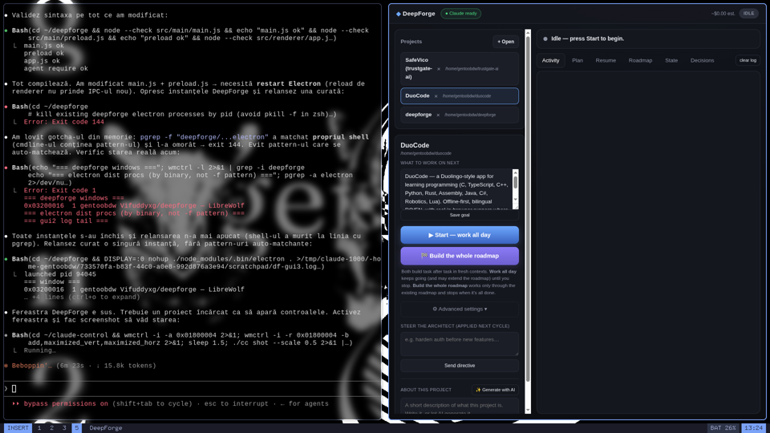

# DeepForge

Desktop orchestrator that builds **deep** software with **always-fresh** Claude Code agents.

> **Status: early / unproven.** The architecture is complete and the GUI runs, but the
> orchestrator loop hasn't been validated end-to-end on a real build yet. Treat it as a
> work-in-progress, not a finished tool.

You open a project, set a goal, press **Start**, and DeepForge runs cycle after cycle —
each task in a brand-new Claude context — until you toggle it off. It picks up exactly
where it left off, because all memory lives in versioned files, not in a chat history
that rots as it grows.

## What it looks like



The left panel drives a run: **What to work on next** (a directive applied next cycle),
**Start — work all day** / **Build the whole roadmap**, and an **About this project**
description you can write or generate with AI. The right panel streams live activity,
the plan, the roadmap, and project state.

## The problem it solves

Long Claude conversations degrade: as context fills with old messages and dead ends,
the model gets distracted and output quality drops. The usual workaround — manually
starting fresh prompts — is tedious and loses continuity.

DeepForge makes freshness **structural**: every task is a fresh headless session
(`claude -p`, no `--resume`), and continuity is provided by a disciplined, compacted
state layer on disk.

## How a cycle works

```
[architect] fresh, read-only  → picks the next task + writes a deep brief (strict JSON)
     │  brief gate rejects vague tasks before any worker runs
[worker]    fresh             → implements ONLY that task, within declared files
[gates]     deterministic     → runs test / build / typecheck — hallucination dies here
     │  up to 2 fresh fix-workers if gates fail
[reviewer]  fresh, skeptical  → checks real depth & acceptance criteria, not just "compiles"
[integrate] git commit + record decision + update plan
     ... every 10 cycles: a compactor rewrites STATE/DECISIONS so they never rot ...
```

Nothing trusts an agent's "done" — a task completes only when objective gates pass
**and** an independent reviewer confirms it.

## State layer (`.orchestrator/` in your project, versioned in git)

| File | Role |
|------|------|
| `config.json` | goal, model, per-agent budget, gate commands, depth-first toggle |
| `ROADMAP.md` | capabilities, depth-first order |
| `plan.json` / `PLAN.md` | tasks + status (source of truth / human view) |
| `STATE.md` | current state of the world (compacted, not append-only) |
| `DECISIONS.md` | ADRs — *why* things were done |
| `DIRECTIVES.md` | what you told the architect live (drained each cycle) |
| `SESSION.md` | handoff for resuming |
| `briefs/` | the brief for each task |
| `log.jsonl` | machine log of every cycle |

## Depth, not 200 bad utilities

- **Depth-first policy** in the architect prompt: harden what exists before adding new.
- **Brief gate**: a task needs concrete files, contracts, rationale, and ≥2 verifiable
  acceptance criteria, or it's rejected before a worker is spent.
- **Reviewer** judges completeness/edge-cases, not compilation.

## Steering live

Type into "Steer the architect" any time — it lands in `DIRECTIVES.md` and is applied at
the start of the next cycle (e.g. "harden auth before new features", "add billing to the
roadmap"). No need to stop the run.

## Requirements

- Node 18+ and git
- At least one agent provider on `PATH` (see **Providers** below):
  - `claude` CLI (Claude Code), authenticated — the default
  - and/or `codex` CLI (OpenAI Codex), authenticated
  - and/or `ollama` (local models) — text-only, see caveat below

## Providers

DeepForge can drive any of three backends. Set `provider` in the project's
`.orchestrator/config.json` (default `claude`):

| `provider` | Backend | Agent? | Notes |
|-----------|---------|--------|-------|
| `claude` | Claude Code (`claude -p`) | ✅ full | Default. Honors model/effort/allowedTools and the USD budget cap. |
| `codex` | OpenAI Codex (`codex exec`) | ✅ full | Edits files & runs commands like Claude. Reports tokens (no USD budget cap). |
| `ollama` | Local LLM (`ollama run`) | ⚠️ text-only | **Cannot edit files or use tools.** Useful only for *planning* roles — an Ollama worker will describe changes but not apply them. |

Each provider runs **fresh per task** (no resume), preserving DeepForge's
anti-context-rot guarantee. Set `model` in config to override the default model
for the chosen provider; the built-in tiered model routing applies to `claude`
only.

> **codex / ollama** run with their sandbox + approval prompts disabled (full
> autonomy), matching the Claude provider's `bypassPermissions` posture. Only
> point DeepForge at a project folder you trust it to modify.

## Install

### Step 1 — Install an AI agent CLI (one-time, required)

DeepForge drives an agent CLI, so you need **at least one** installed and logged in.
This is the only step that touches a terminal; after it, DeepForge itself is double-click.

- **Claude Code** (recommended): install [Node.js](https://nodejs.org) (LTS), then run:
  ```bash
  npm install -g @anthropic-ai/claude-code
  claude          # opens a browser to log in (Claude subscription or API key)
  ```
- **OpenAI Codex** (alternative): `npm install -g @openai/codex`, then `codex` to log in.
- **Ollama** (local, free, text-only — planning roles only): install from [ollama.com](https://ollama.com).

### Step 2 — Install the DeepForge app

**Windows & macOS — download and double-click:**

1. Open the **[Releases](../../releases)** page.
2. Download **`DeepForge-Setup-x.y.z.exe`** (Windows) or **`DeepForge-x.y.z.dmg`** (macOS).
3. Double-click to install, then launch DeepForge.
4. **Open** a project folder → write a goal → **Start**.

> Builds aren't code-signed yet, so the OS shows a one-time warning:
> **Windows** → "More info" → "Run anyway". **macOS** → right-click the app → "Open" → "Open".

(**Linux**: download the `.AppImage`, `chmod +x DeepForge-*.AppImage`, run it.)

## Build the installers yourself

On the **same OS you're targeting**, with Node 18+:

```bash
npm install
npm run dist:win     # → dist/DeepForge-Setup-*.exe   (run on Windows)
npm run dist:mac     # → dist/DeepForge-*.dmg          (run on macOS)
npm run dist:linux   # → dist/DeepForge-*.AppImage
```

> Windows and macOS installers must be built on their own OS (or in CI runners for
> each). Code signing (Apple Developer ID / a Windows cert) is optional and only
> removes the one-time "unidentified developer / SmartScreen" prompt.

## Run from source (developers)

```bash
cd deepforge
npm install          # downloads Electron
npm run gui          # desktop app   (or: npm start — terminal UI)
```

Then: **Open…** a project folder → write a product goal → **Start & continue**.

## Cost & safety

- Each agent is capped with `--max-budget-usd` (configurable per agent).
- Live cumulative spend is shown in the top bar.
- `maxCyclesPerRun` (0 = unlimited) bounds an autonomous run.
- Everything is committed to git, so any cycle is inspectable and revertible.

> Gates auto-detect npm / cargo / go / pytest. For other stacks, set explicit commands
> in `.orchestrator/config.json` under `gates.{test,build,typecheck}`. Without gates,
> verification falls back to the reviewer only — set them for real protection.
